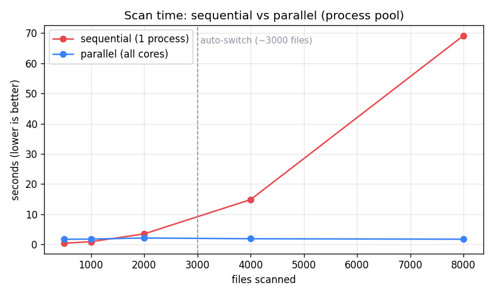
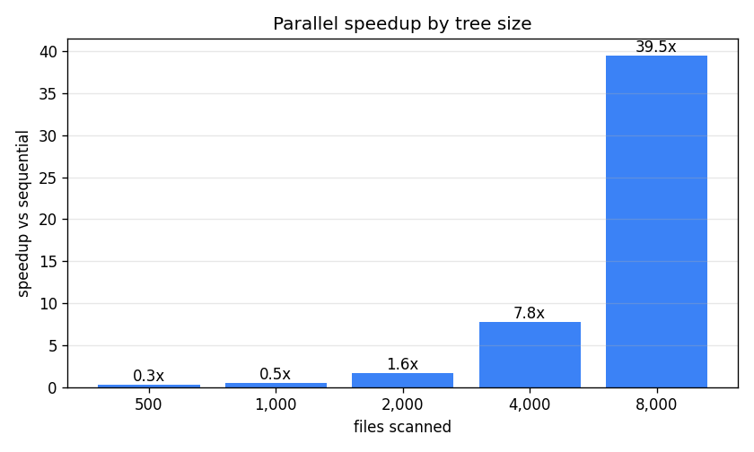
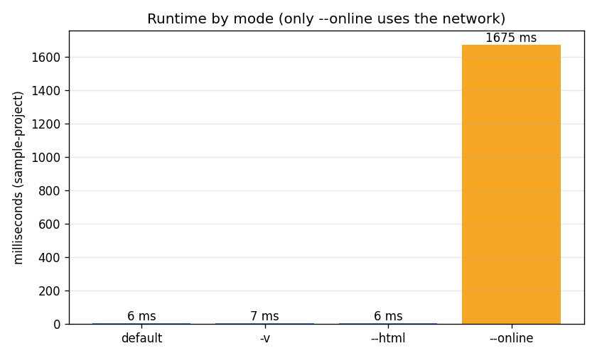

# Mini Static Findings Scanner

A small command-line tool that scans a folder of source files and reports likely security and code-quality problems. It stays simple and explainable: everything is plain regex plus a few deterministic heuristics, no machine learning, so every finding traces back to a specific rule you can read. It runs fully offline by default; the only network call is the optional dependency check (`--online`), which looks up known CVEs from OSV.dev and sends nothing but package names and versions.

## 1. Highlights

1.1 **15 rules** covering secrets, dangerous calls, weak crypto, injection, CORS, debug config, sensitive files and more, plus an opt-in dependency CVE check against OSV.dev.

1.2 **A confidence score on every finding**, tracked separately from severity, so results can be triaged instead of just listed.

1.3 **A false-positive validator layer** that drops the usual noise (placeholders, env-var reads, example URLs, `# nosec` lines).

1.4 **Five outputs**: console, JSON, Markdown, SARIF (for GitHub code scanning), and a self-contained interactive HTML report.

1.5 **Offline by default**: the only network call is the dependency check, it is opt-in, and it never sends your code.

1.6 **Process-parallel scanning** that kicks in automatically past ~3,000 files (a measured threshold), so large trees scan across all cores while small ones stay sequential and fast.

## 2. Quick start

You need Python 3.8 or newer. The only runtime dependency is `packaging`. Run the setup script once: it creates a virtual environment in `.venv`, installs the pinned dependency, and installs the `scanner` command.

2.1 Windows (PowerShell):

```powershell
.\setup.ps1
.\.venv\Scripts\Activate.ps1
```

2.2 macOS / Linux:

```bash
./setup.sh
source .venv/bin/activate
```

If PowerShell blocks the script, run `Set-ExecutionPolicy -Scope Process -ExecutionPolicy Bypass` once first. If you would rather not install anything, run it straight from the repo with `python main.py <folder>` instead of the `scanner` command.

2.3 Then scan the included sample project:

```bash
scanner ./sample-project
```

It prints a table and writes `findings.json` and `findings-report.md` next to wherever you run it:

```
 #  SEVERITY  LOCATION             SHORT EXPLANATION
--  --------  -------------------  -----------------
 1  HIGH      src/config.js:1      Possible hardcoded secret or credential found
 2  MED       src/server.js:2      Broad CORS policy allows requests from any origin
 ...
```

## 3. How it works

3.1 It walks the folder, skipping the usual noise (`.git`, `node_modules`, `dist`, `build`, virtual envs, caches).

3.2 Each rule is a regex plus optional context keywords and a list of validators. The regex finds candidates; the validators decide whether they are real.

3.3 The validators are what keep the noise down. They drop obvious false positives and adjust a confidence score from 0 to 1. Severity comes from the rule ("how bad if it's real"); confidence is separate ("how sure it is real").

3.4 With `--online`, it parses `requirements.txt` / `package.json` and asks the OSV.dev database whether any pinned version has a known CVE, sending only the package name and version.

3.5 Findings are de-duplicated, ranked by severity then confidence, printed, and written to whichever report formats you ask for.

## 4. Modes and flags

The default run is offline and writes JSON + Markdown. Everything else is a flag on top of that.

4.1 `--online`: enable dependency CVE lookups via OSV.dev. Off by default; the only flag that uses the network.

4.2 `-v`, `--verbose`: show the rule name, CWE, confidence and fix under each finding.

4.3 `--min-confidence N`: drop findings below confidence N (0.0 to 1.0).

4.4 `-j N`, `--jobs N`: how many worker processes to scan with. Defaults to the CPU count.

4.5 `--config FILE`: load a JSON config (also auto-loads `scanner.config.json` if present).

4.6 `--enable-rule "Name"`: run only this rule. Repeatable.

4.7 `--disable-rule "Name"`: turn a rule off. Repeatable.

4.8 `--list-rules`: print every rule name and exit.

4.9 `--json PATH`: where to write the JSON report (default `findings.json`).

4.10 `--md PATH`: where to write the Markdown report (default `findings-report.md`).

4.11 `--sarif [PATH]`: also write a SARIF report (default `findings.sarif`).

4.12 `--html [PATH]`: also write an interactive HTML report, open it, and print a clickable link (default `findings.html`).

Examples:

```bash
scanner ./sample-project --online                  # include dependency CVEs
scanner ./sample-project --min-confidence 0.6      # only the confident findings
scanner ./sample-project -v                         # full detail in the console
scanner ./sample-project --html                     # open the review UI
scanner ./sample-project --disable-rule "Insecure HTTP URL"
scanner --list-rules
```

## 5. Output formats

5.1 **Console**: a numbered table with severity, file:line and the short explanation. Add `-v` for the rule name, CWE, confidence and remediation.

5.2 **JSON** (`findings.json`): every field per finding, plus a summary count.

5.3 **Markdown** (`findings-report.md`): grouped by severity, each finding shown with its location, CWE, confidence and fix. Named this way so it doesn't collide with `FINDINGS.md` on case-insensitive filesystems.

5.4 **SARIF** (`--sarif`): standard 2.1.0 output that GitHub code scanning and the VS Code SARIF viewer understand.

5.5 **HTML** (`--html`): a single self-contained page you can filter and search, with remediation shown inline. It opens in your browser, and the file link is printed to the console in case it doesn't. No server, nothing leaves your machine.

Generated example reports (from scanning `sample-project/` with `--online`) are checked in under `examples/`, so you can see every format without running anything. The live `findings.*` files the tool writes are gitignored, since on a real codebase a report can quote actual secrets.

## 6. Rules

Fifteen rules cover secrets, dangerous calls, insecure deserialization, weak crypto, SQL injection, path traversal, TLS verification, CORS, debug config, insecure URLs, sensitive files and suspicious comments. Run `scanner --list-rules` for the full list, or see `FINDINGS.md` for the breakdown. The opt-in dependency check (`--online`) adds two more: known-vulnerable package versions and unpinned dependencies.

## 7. Config file

Drop a `scanner.config.json` next to where you run the tool (it is picked up automatically), or pass one with `--config`:

```json
{
  "min_confidence": 0.0,
  "enabled_rules": [],
  "disabled_rules": ["Insecure HTTP URL"]
}
```

`enabled_rules` is an allowlist (if it is non-empty, only those rules run). `disabled_rules` turns rules off. The `--enable-rule` / `--disable-rule` flags merge with whatever is in the file.

## 8. Performance

All numbers below were measured on this machine (Python 3.11, 8 logical cores) using the committed benchmark script. Regenerate them any time with `python benchmarks/benchmark.py` (it needs matplotlib; the scanner itself does not, and the charts are committed so you don't have to run it).

8.1 Single-core throughput is around 750 files per second on typical source files.

8.2 **Parallelism that switches on automatically.** File scanning is CPU-bound regex work, which does not speed up with threads because of Python's GIL, so the scanner uses a process pool instead. Spawning processes costs about a second on Windows, so for small and medium trees a plain sequential pass is actually faster. The scanner handles this automatically: it stays sequential until the tree crosses a size threshold (`PARALLEL_THRESHOLD`, set to 3,000 files in `engine.py`), and only then distributes the work across all cores. Sequential and parallel cross at roughly 2,500 to 3,000 files; past that, parallel stays flat while sequential climbs.



The same data as a speedup factor makes the rule obvious: below the threshold the process pool is a net loss (which is why the tool does not use it there), and above it the win grows with the tree, reaching roughly 6x at 8,000 files.



8.3 **Cost by mode.** Every mode runs the sample project in a few milliseconds, with one exception: `--online`. The dependency CVE lookups are network round-trips to OSV, which dominate everything else (hundreds of milliseconds to over a second, depending on latency). That is the reason the network is opt-in rather than on by default; `-v` and `--html` add no meaningful overhead.



## 9. Tests

```bash
python -m unittest discover -s tests
```

Over 70 tests cover rule detection, false-positive validators, dependency parsing and version logic (with network calls mocked), language detection, all report formats, and the parallel scan path.

A separate edge-case suite (`tests/test_edge_cases.py`) exercises failure scenarios including empty folders, binary/large/unicode files, malformed `package.json` and `requirements.txt`, `--online` with no internet, permission-denied files, broken symlinks, and invalid CLI arguments. The scanner degrades gracefully in each case. (Symlink tests are skipped on Windows unless Developer Mode is enabled, since symlink creation requires elevated privileges.)

## 10. Beyond the brief

These go beyond what the brief asked for. I added them to make the tool more practical and to show how I would approach the problem in a production setting:

10.1 **Dependency (SCA) scanning** against the OSV.dev database, so the tool catches known-vulnerable package versions, not just risky code.

10.2 **A confidence score** on every finding, kept separate from severity, so results can be triaged rather than dumped in a flat list.

10.3 **Process-parallel scanning with a threshold I measured rather than guessed.** I benchmarked sequential vs threads vs processes, found the GIL caps threaded regex, and set the auto-switch point from the actual crossover (the Performance charts above).

10.4 **A reproducible benchmark** (`benchmarks/benchmark.py`) that generates those charts, so the performance claims are backed by measurements.

10.5 **Hardening for scanning untrusted code**: a per-line length cap so a crafted line can't stall a regex (ReDoS), and symlink handling that won't follow links outside the target folder.

10.6 **A one-command setup** (`setup.ps1` / `setup.sh`) and a pinned dependency for reproducible installs.

## 11. Project layout

```
main.py                 thin entry point (python main.py ...)
scanner/
  cli.py                argument parsing and the run flow
  engine.py             file walking, scanning, parallelism, dedup, ranking
  rules.py              the rule definitions
  validators.py         false-positive validators and confidence scoring
  entropy.py            Shannon entropy helper
  languages.py          file-extension language detection
  sca.py                dependency parsing and OSV lookups
  reporter.py           console, JSON, Markdown, SARIF and HTML output
  schema.py             the Rule and Finding data structures
sample-project/         a small project with planted issues to scan
examples/               generated example reports (json, md, sarif, html)
benchmarks/             benchmark script and the charts in this README
tests/                  unit tests
setup.sh / setup.ps1    one-command bootstrap
```

See `FINDINGS.md` for the writeup on the rules, the false positives and negatives, and how I would prioritize findings in practice.

## 12. Acknowledgement

Thank you for the assignment. I genuinely enjoyed building this project. What began as a simple pattern scanner became a useful exercise in balancing detection coverage, false-positive reduction, performance, and developer usability while keeping the scope aligned with the brief. I kept it scoped to the assignment, though there is more I could add with more time. I hope it meets what the team is looking for.

Sincerely,

Prahar Shah